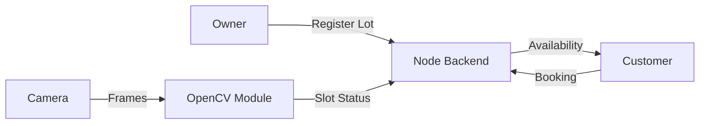

# 🅿️ Smart Parking System
## Web Link: https://smart-parking-system-sandy.vercel.app
### 📄 System Design & Workflow

The **Smart Parking System** is a role-based, location-aware web platform designed to manage commercial and private parking spaces efficiently. The system allows parking owners to enlist and manage their parking lots, while customers can discover and book the nearest available parking space based on **real-time availability** and **geographic proximity**.

> The architecture is modular and supports **optional camera-based parking detection** using classical OpenCV techniques, while also allowing manual parking management for owners without camera infrastructure.

---

## 🎯 1. Problem Statement

Urban parking suffers from multiple inefficiencies:
*   ❌ No reliable real-time availability
*   ❌ Underutilization of private parking spaces
*   ❌ Time and fuel wastage while searching for parking
*   ❌ High cost of sensor-based solutions

Most existing systems either rely on static listings or expensive hardware, making them unsuitable for wide adoption.

---

## 🚧 2. Limitations of Existing Systems

*   **Hardware Costs:** Sensor systems increase installation and maintenance cost.
*   **ML Sensitivity:** Dataset-trained models are sensitive to lighting and camera angles.
*   **Static Listings:** Do not reflect live occupancy.
*   **Inefficient Allocation:** Parking allocation is not optimized using user location.

These challenges motivated a **deterministic, owner-configurable, and location-driven approach**.

---

## 💡 3. Proposed Solution

The system introduces:
*   ✅ **Role-Based Access**: Specialized interfaces for **Owners** and **Customers**.
*   ✅ **Location-Based Discovery**: Uses Maps APIs for finding nearest spots.
*   ✅ **Dual-Mode Management**: Manual slot configuration OR **Optional OpenCV-based camera detection**.
*   ✅ **Unified Availability**: A single source of truth for slot status.
*   ✅ **Secure Operations**: JWT authentication and database-backed reliability.

*The system avoids heavy machine learning dependencies and instead uses explainable, classical image processing where camera detection is enabled.*

---

## 🏗️ 4. System Architecture

### Actors
*   **Parking Owner**: Manages lots, prices, and settings.
*   **Parking Customer**: Searches and books parking.
*   **Camera System** (Optional): Provides automated occupancy updates.

### Core Components
| Component | Tech Stack | Description |
| :--- | :--- | :--- |
| **Frontend** | React + Tailwind | Responsive user interface. |
| **Backend** | Node.js + Express | REST API and business logic. |
| **Database** | MongoDB | Stores users, lots, and bookings. |
| **CV Module** | Python + OpenCV | Processes camera feeds (runs locally). |

---

## 🔄 5. End-to-End Workflow

1.  **Owner Registration**: Log in and enlist a parking lot (name, location, price).
2.  **Configuration**: Owner enables camera detection OR chooses manual mode.
3.  **Slot Definition**: Owner draws parking slots on a reference image (if using cameras).
4.  **Customer Search**: Customer logs in; system queries nearby lots using Geolocation.
5.  **Availability Check**: System checks real-time slot status (from Database).
6.  **Booking**: Customer selects a spot and confirms booking.

---

## 📷 6. Camera-Based Detection (Optional)

This feature matches real-world usage where hardware is available.

1.  **Reference:** Owner selects parking regions on a reference image.
2.  **Processing:**
    *   Frames converted to grayscale.
    *   Adaptive thresholding & morphological ops applied.
    *   **Logic:** If pixel density > threshold → `Occupied`.
3.  **Update:** Status sent to backend API.

---

## 📊 7. Data Flow

---

## 💻 8. Technology Stack

*   **Frontend**: React, Tailwind CSS, Maps API
*   **Backend**: Node.js, Express.js, JWT Auth
*   **Computer Vision**: Python, OpenCV (Classical Techniques)
*   **Database**: MongoDB

---

## 🔒 9. Security

*   **Authentication**: Secure JWT-based login.
*   **Authorization**: Protected routes for Owners vs Customers.
*   **Data Protection**: Password hashing (bcrypt).

---

## ⚠️ 10. Limitations

*   **Setup**: Manual slot definition requires initial configuration.
*   **Hardware**: Camera accuracy depends on lighting/angle.
*   **Connectivity**: Real-time updates require stable network.

---
